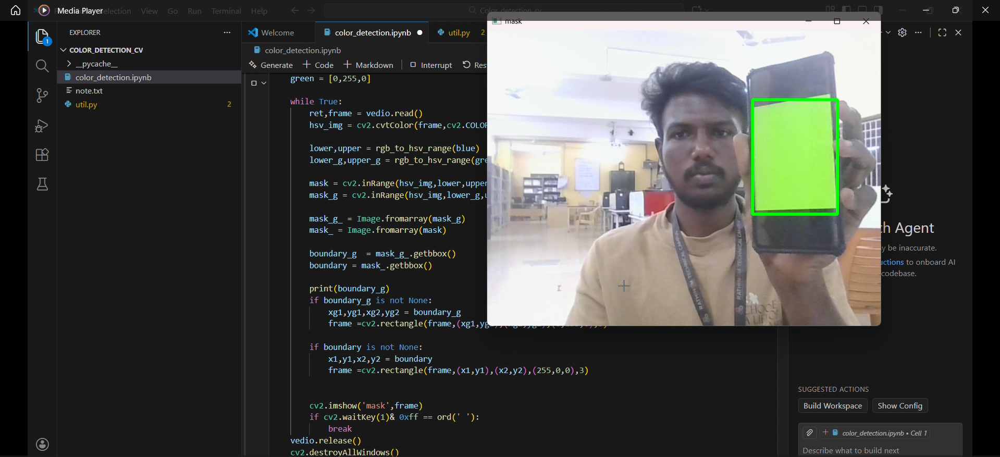

# 🎨 Real-Time Color Detection using OpenCV

A real-time **Computer Vision** project that detects **Blue** and **Green** colored objects from a live webcam feed and highlights them with bounding boxes using the **HSV color space**.  
This approach is robust to lighting variations and works efficiently without using any ML model.

---

## 📸 Project Screenshots

### 🔵 Blue Color Detection
The system successfully detects blue-colored objects and draws a **blue bounding box** around them.


---

### 🟢 Green Color Detection
The system detects green-colored objects and highlights them with a **green bounding box** in real time.



---

## 🚀 Features

- Real-time webcam input
- Accurate color detection using HSV
- Blue and Green color localization
- Bounding box visualization
- Lightweight and fast
- No machine learning required
- Easy to extend for additional colors

---

## 🛠️ Tech Stack

- **Python**
- **OpenCV**
- **NumPy**
- **Pillow (PIL)**
- **HSV Color Space**

---


## ⚙️ Installation & Setup

### 1️⃣ Install Dependencies
```bash
pip install -r requirements.txt


